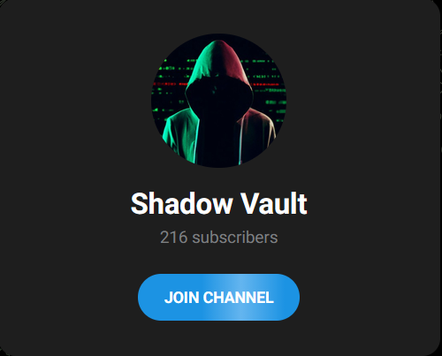
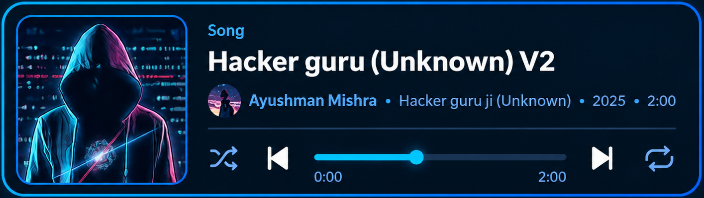

<p align="center">
  <a href="https://ayushman.live/"></a>
  <a href="https://t.me/unknownlll2829"></a>
  <a href="https://open.spotify.com/artist/14RQhXQDhmN05G9Z24Fbk6"></a>
  <!-- STATUS-TOP:START --><!-- STATUS-TOP:END -->
</p>

---

##  // WHO I AM

**NAME:** Ayushman Mishra  
**ALIAS:** Hacker guru ji, Unknown

I'm Ayushman Mishra — a developer and AI engineer focused on building practical tools. From AI-powered chatbots like Dexter AI and encryption systems like Phantom Vault to identity generators and prompt engineering research, I enjoy working on projects that push boundaries and give users more control over their digital experience. Find my open-source work on [GitHub](https://github.com/Unknown-2829).

What I Focus On:
- 🤖 Building AI systems that are genuinely useful
- 🧠 Exploring the limits of large language models
- 🔐 Privacy-first software design
- 🌍 Open-source contributions and knowledge sharing

Primary Domains:
```
├─ AI & LLM Engineering
├─ Prompt Engineering & Research
├─ Cryptographic Systems
├─ Bot Development
├─ Full-Stack Web Development
└─ Security Research
```

---

##  // GITHUB STATS

<br>

<!-- DYNAMIC-STATS:START -->
<p align="center">
  
</p>

<p align="center">
  
</p>

<!-- Themed gradient divider with tier-specific effect -->
<p align="center">
  
</p>

<!-- Streak Stats - Dynamically Themed -->
<p align="center">
  
</p>

<!-- Activity Graph - Themed -->
<p align="center">
  
</p>

<!-- Themed gradient divider with tier-specific effect -->
<p align="center">
  
</p>

<p align="center">
  <sub>🎨 <i>🌱 Growing | Powered by GitHub Actions</i></sub>
</p>

<p align="center">
  <sub><code>Last refresh: 3 Oct 2026, 03:07 IST</code></sub>
</p>
<!-- DYNAMIC-STATS:END -->

<!-- ANALYTICS:START -->
<!-- ANALYTICS:END -->

---

##  // PROJECTS

<details>
<summary><b>🤖 DEXTER AI — Multi-Model AI Chatbot</b></summary>
<br>

> A multi-model AI chatbot with dual personality modes, real-time conversation memory, and no restrictive content filters — built for users who want straightforward, unfiltered AI responses.

**Specifications:**
- Multi-model LLM orchestration with dual-mode personality engine
- Advanced prompt control · Real-time conversation memory
- Zero-logging architecture · 99%+ uptime

| Metric | Value |
|--------|-------|
| Uptime | 99%+ |
| Memory | 66 MB |
| Daily Conversations | 1,000s |

**Links:** [Try Dexter AI →](https://t.me/Dexter_Unsensored_AI_bot)

> ⚠️ **NOTE:** Use responsibly. Built for research and open conversation.

</details>

<details>
<summary><b>🔐 PHANTOM VAULT — Custom Encryption System (.unk)</b></summary>
<br>

<!-- LIVE-PROJECT:phantom_vault:START -->
<p>
   &nbsp; (🔄 Synced · <a href="https://github.com/Unknown-2829/Unknown-2829/actions">auto-updated every ~6h</a>)
</p>
<!-- LIVE-PROJECT:phantom_vault:END -->

---

> A custom file encryption system using the proprietary **.unk** format — files become unrecognizable binary data, invisible to standard tools.

**The Problem:** Standard file formats can be easily read and intercepted.  
**The Solution:** A custom encrypted format that's completely invisible to standard tools.

```
🔒 AES-256-CBC Encryption     🔒 PBKDF2 100K Iterations
🔒 Hardware-Locked Licensing  🔒 Zero-Knowledge Architecture
```

**Features:**
- Encrypts any file into the .unk format — appears as random binary data
- No file signature or magic bytes — completely undetectable
- Hardware-locked licensing · Activation key required

**Links:** [📥 Download Phantom Vault →](https://unk-extention.unknowns.app/) | [📡 Get Activation Key →](https://t.me/+JMGc_8bWeWQ4ZmU1)

</details>

<details>
<summary><b>🆔 PHANTOM ID — Test Identity Generator</b></summary>
<br>

<!-- LIVE-PROJECT:phantom_id:START -->
<p>
   &nbsp; (🔄 Synced · <a href="https://github.com/Unknown-2829/Unknown-2829/actions">auto-updated every ~6h</a>)
</p>
<!-- LIVE-PROJECT:phantom_id:END -->

---

> Generate realistic test identities for 25+ countries — useful for testing, development, and data generation. **Available on ChatGPT.**

```
🧑 Personal Details   → Name, DOB, Physical Traits
📄 Document Numbers   → ID formats, Tax IDs
💳 Financial Data     → Bank formats, IBAN structures
🌐 Digital Footprint  → Email, Username, IP addresses
🏠 Complete Address   → Street, City, State, Postal
```

**Supported Regions:**  
🇺🇸 🇬🇧 🇩🇪 🇫🇷 🇮🇹 🇪🇸 🇨🇦 🇦🇺 🇯🇵 🇰🇷 🇨🇳 🇮🇳 🇧🇷 🇲🇽 🇷🇺 🇮🇩 🇵🇰 🇳🇬 🇧🇩 🇵🇭 🇻🇳 🇹🇷 🇮🇷 🇹🇭 🇪🇬 [+more]

**Links:** [🤖 Telegram Bot →](https://t.me/phantom_id_bot) | [🌐 Web App →](https://phantom-id.onrender.com) | [🤖 ChatGPT →](https://chatgpt.com/g/g-69c92c29e934819182d9c495d76e29cd-phantom-id-fake-identity-generator)

> ⚠️ **NOTE:** Generated data is for testing and research purposes only.

</details>

<details>
<summary><b>📚 LLM PROMPT ENGINEERING RESEARCH</b></summary>
<br>

<!-- LIVE-PROJECT:llm-prompt-engineering:START -->
<p>
   &nbsp; (🔄 Synced · <a href="https://github.com/Unknown-2829/Unknown-2829/actions">auto-updated every ~6h</a>)
</p>
<!-- LIVE-PROJECT:llm-prompt-engineering:END -->

---

> Systematic research into prompt engineering techniques, LLM capabilities, and AI safety testing. Open-source and publicly available.

**Research Areas:**
- Prompt engineering techniques & best practices
- LLM capability probing & benchmarking · AI safety testing
- Multi-model comparison · Adversarial prompt research

**Models Tested:**
```
ChatGPT-5 / GPT-4o / o1          Gemini 3 / Gemini 3 Thinking / Gemini 3 Pro
Gemini 2.5 Flash & Pro
```

**Links:** [View on GitHub →](https://github.com/Unknown-2829/llm-prompt-engineering)

</details>

<details>
<summary><b>🎬 PHANTOM TERMINAL — Cinematic Shell Startup</b></summary>
<br>

<!-- LIVE-PROJECT:Phantom-terminal:START -->
<p>
   &nbsp; (🔄 Synced · <a href="https://github.com/Unknown-2829/Unknown-2829/actions">auto-updated every ~6h</a>)
</p>
<!-- LIVE-PROJECT:Phantom-terminal:END -->

---

> A cinematic startup animation for your terminal — cross-platform across **Windows, Linux, macOS, and Termux**. Matrix rain, dual themes, glitch effects, custom dashboard — one-line install.

**Features:**
- 🎬 Multi-stage cinematic startup animation
- 🌧️ Matrix rain — Letters or Binary mode
- 🎨 Two themes — Phantom (purple/cyan) & Unknown (green/blue)
- 💀 Glitch reveal logo · 📊 Dashboard with uptime & quotes
- 🔄 Auto-update · ⚙️ Persistent config · 🥚 Easter eggs

**Quick Install:**
```powershell
irm https://raw.githubusercontent.com/Unknown-2829/Phantom-terminal/main/install.ps1 | iex
```
```bash
curl -fsSL https://raw.githubusercontent.com/Unknown-2829/Phantom-terminal/main/install.sh | bash
```

**Links:** [View on GitHub →](https://github.com/Unknown-2829/Phantom-terminal)

</details>

<details>
<summary><b>📧 PHANTOM MAIL — Disposable & Permanent Email</b></summary>
<br>

<!-- LIVE-PROJECT:phantom_mail:START -->
<p>
   &nbsp;  &nbsp; (🔄 Synced · <a href="https://github.com/Unknown-2829/Unknown-2829/actions">auto-updated every ~6h</a>)
</p>
<!-- LIVE-PROJECT:phantom_mail:END -->

---

> A disposable email service on Cloudflare Pages + Email Workers. Instant throwaway addresses — no signup, fully private. **Available on ChatGPT.**

**Free Plan:**
- ✨ Instant generation — no signup · 📬 Real-time inbox (5s refresh)
- 📋 One-click copy · ⏱️ 1-hour expiry · 🔒 No logs, no trackers

**Premium Plan** `$3/mo · $20/yr`
- 💾 8 permanent addresses · 🎯 Custom usernames · 📅 30-day retention
- 📨 Email forwarding · 🔌 Developer API — 10,000 req/day

**Architecture:**
```
User Browser → Cloudflare Pages (Frontend + API)
             → Cloudflare KV (Storage)
             → Cloudflare Email Worker (Receives emails)
```

**Links:** [🌐 Try Phantom Mail →](https://mail.unknowns.app) | [GitHub →](https://github.com/Unknown-2829/Phantom-mail) | [🤖 ChatGPT →](https://chatgpt.com/g/g-69c8f9437d088191b67ec75c1f67f2e4-phantom-mail-gpt)

</details>

---

##  // TECH STACK

<p align="center">
  <a href="https://skillicons.dev">
    
  </a>
</p>

```python
primary_language    = "Python"
frameworks          = ["FastAPI", "Flask", "Telethon", "python-telegram-bot"]
databases           = ["PostgreSQL", "SQLite", "MySQL"]
encryption          = ["PyCryptodome", "AES-256", "PBKDF2"]
frontend            = ["React", "PyQt6", "HTML5/CSS3/JS"]
ai_apis             = ["OpenAI", "Google AI", "Anthropic"]
deployment          = ["Render", "Railway", "Self-Hosted VPS"]
```

<details>
<summary><b>📜 // RECENT LOGS (GitHub Activity — Synced every ~6h)</b></summary>
<br>

> 🔄 **GitHub Activity Feed:** _Recent public events from GitHub, auto-synced every ~6h via GitHub Actions._

<!-- RECENT-ACTIVITY:START -->
- `Unknown-2829` — delete (1d ago)
- `Unknown-2829` — pushed (1d ago)
- `Unknown-2829` — pushed (1d ago)
- `Unknown-2829` — pushed (1d ago)
- `Unknown-2829` — pushed (1d ago)
<!-- RECENT-ACTIVITY:END -->

</details>

---

## 💭 // PHILOSOPHY

On Responsibility:
> *"Every tool can be used for good or bad. As builders, we focus on the good — but we trust users to make the right choices."*

The hammer isn't responsible for what you hit.  
The lockpick isn't responsible for what you unlock.  
The code isn't responsible for what you execute.

---

## 🧩 // SKILLS & EXPERTISE

Core Competencies:
- **AI Engineering** — Building practical AI-powered applications
- **Cryptographic Design** — Implementing strong encryption systems
- **Bot Development** — Telegram bots, automation tools
- **Prompt Engineering** — LLM optimization and research
- **System Architecture** — Designing scalable, resilient systems
- **Security** — Privacy-focused development practices

Specializations:
- AI safety testing & red teaming
- Privacy-preserving technology
- Custom encryption implementations
- Scalable infrastructure design
- API development & integration
- Open-source project management

---

## 📡 // SHADOW VAULT TELEGRAM CHANNEL

The central hub for all project updates, releases, and community activity.

<p align="center">
  <a href="https://t.me/+JMGc_8bWeWQ4ZmU1" target="_blank">
    
  </a>
</p>

**What Happens Here:**
- Product launches & system updates
- Alpha/Beta tester recruitment
- Technical architecture disclosures
- Security incident reports
- Community challenges & rewards
- 24/7 support operations

**Channel Updates:**
- DEXTER AI: 99%+ uptime, 66MB memory footprint
- Phantom Vault: Windows release live, activation keys distributed
- Phantom ID: V2.0 launched, 25+ countries live

Community: Small but dedicated. Quality over quantity.

Channel: [Shadow Vault](https://t.me/+JMGc_8bWeWQ4ZmU1) | Discussion: [Group](https://t.me/unknownlll2829)

---

##  // BEYOND CODE

Music is another creative outlet — a different way to express ideas and emotions.

<p align="center">
  <a href="https://open.spotify.com/artist/14RQhXQDhmN05G9Z24Fbk6" target="_blank">
    
  </a>
</p>

<p align="center">
  <a href="https://open.spotify.com/artist/14RQhXQDhmN05G9Z24Fbk6" target="_blank">
    
  </a>
</p>


---

## 📬 // CONTACT

<p align="center">
  <!-- STATUS-CONTACT:START --><!-- STATUS-CONTACT:END -->
</p>

Interested In:
- AI engineering & research roles
- Privacy-focused technology projects
- Full-stack development opportunities
- Open-source collaborations
- Freelance / consulting work
- And more...

<p align="center">
  <a href="https://t.me/unknownlll2829"></a>
  <a href="mailto:unknown@ayushman.live"></a>
  <a href="https://github.com/Unknown-2829"></a>
  <a href="https://ayushman.live"></a>
</p>

---

## ⚠️ DISCLAIMER

```
ALL TOOLS DEVELOPED FOR EDUCATIONAL & RESEARCH PURPOSES
MISUSE IS SOLE RESPONSIBILITY OF END USER
```

- With great power comes great responsibility
- Use tools ethically and within the law
- These projects are meant to help, educate, and empower

---


<p align="center">
  <a href="https://ayushman.live">🌐 ayushman.live</a> • <a href="https://github.com/Unknown-2829">GitHub</a> • <a href="https://t.me/unknownlll2829">Telegram</a>
</p>
